# Vue组件间通信总结与案例分析

## 背景
在Vue开发中，组件是其重要组成部分，同时每个组件间的作用域是相互独立的。组件之间的关系一般是这样的：
     

组件A和组件B、C之间是父子关系，组件B、C之间是兄弟关系，而组件A、D之间是隔代关系。

## 通信方式

*   Props / $emit
*   \$emit / $on
*   Vuex
*   $attr / \$listener
*   Provider / Inject
*   \$parent / $children & \$refs

### 一. Props / $emit
1.props

父组件向子组件传值，通过在父组件上绑定属性来向子组件传入数据，子组件通过 Props属性获取对应数据。
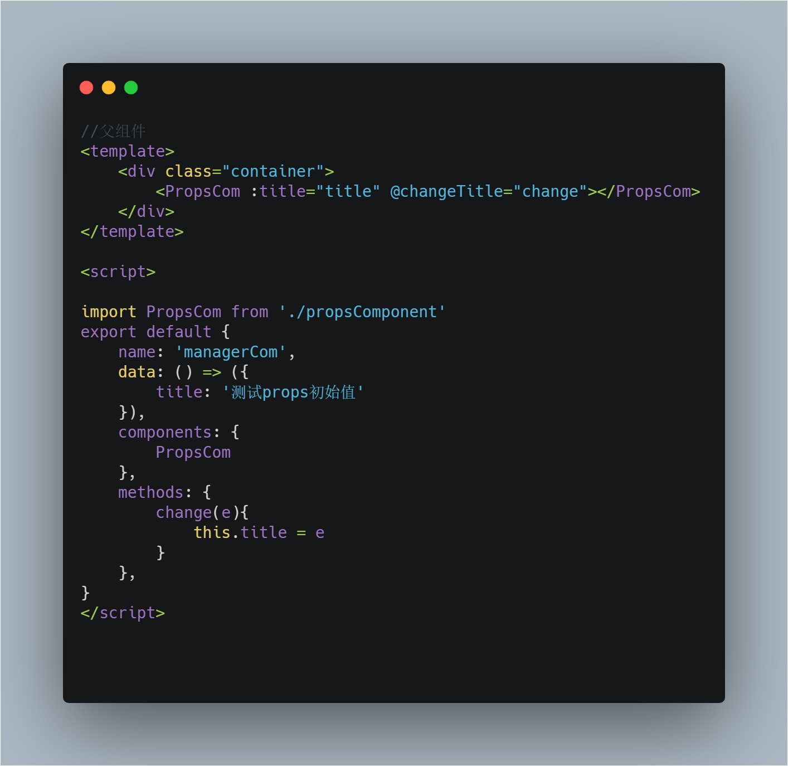

2.$emit 子组件向父组件传值（通过事件形式），子组件通过 $emit 事件向父组件发送消息，将自己的数据传递给父组件。

总结：常用的父子间传输数据的方式。

### 二. \$emit / $on

该方法通过创建了一个空的 vue 实例，当做 $emit 事件的处理中心（事件总线），通过他来触发以及监听事件，方便的实现了任意组件间的通信，包含父子，兄弟，隔代组件。

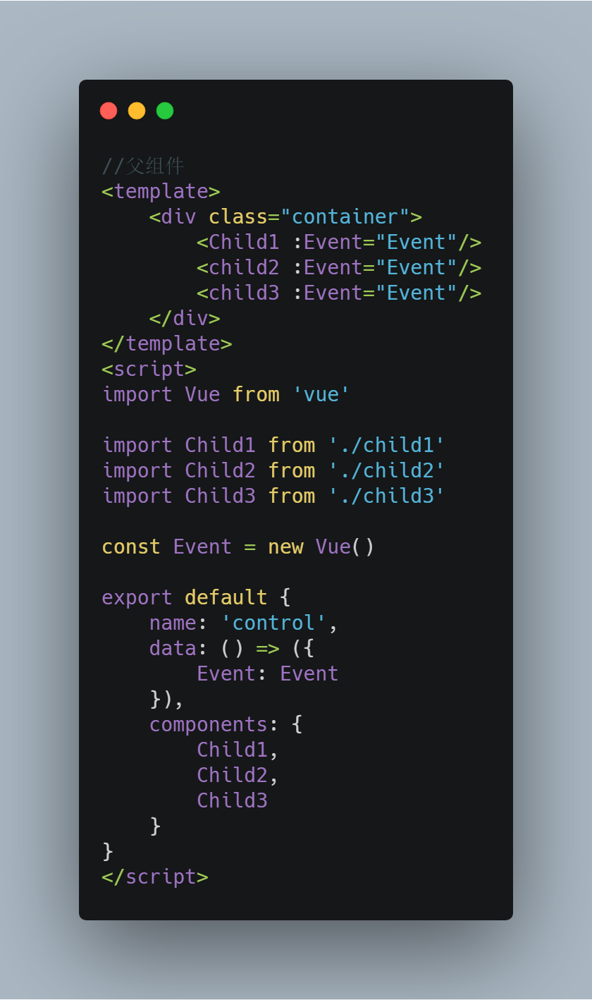
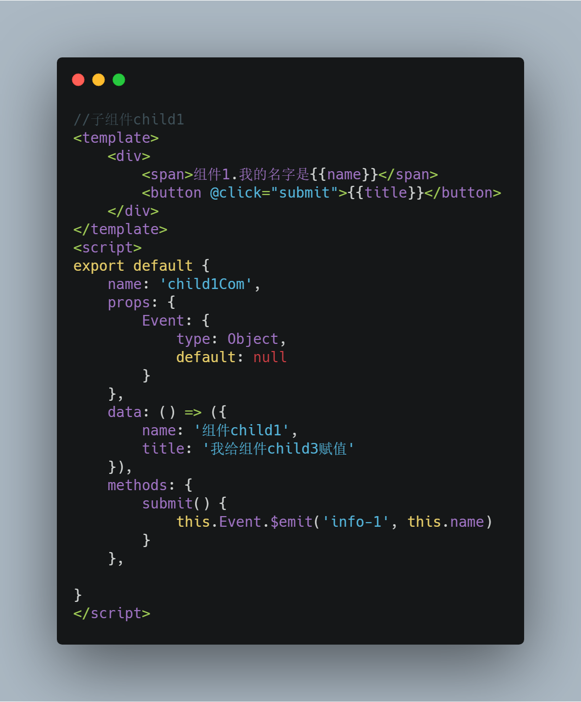
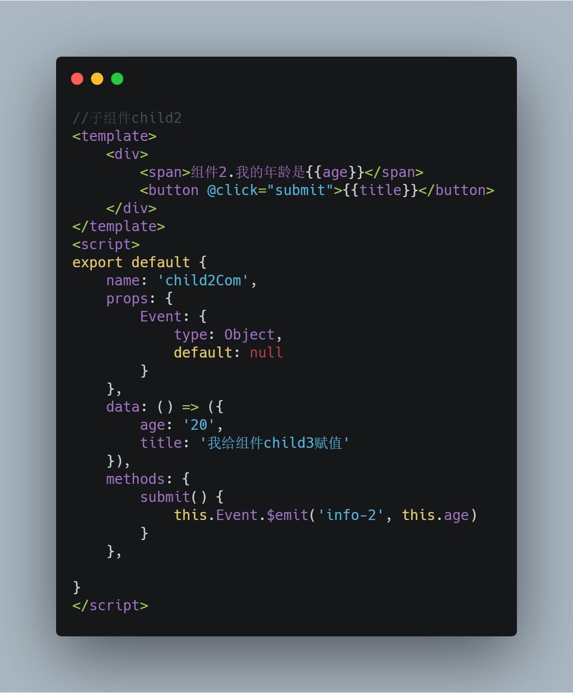

总结：巧妙地在父子，兄弟，隔代组件之间进行数据通信。

### 三. Vuex
全局状态管理，实现一个单项数据流。通过创建一个全局State的数据，组件想要修改State数据只能通过Mutation来进行。
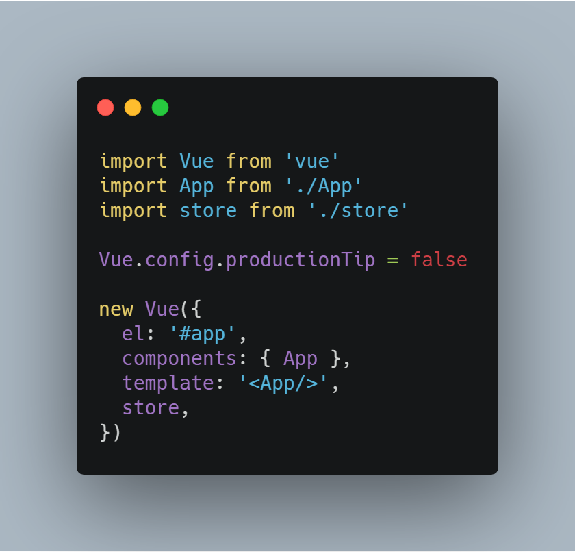

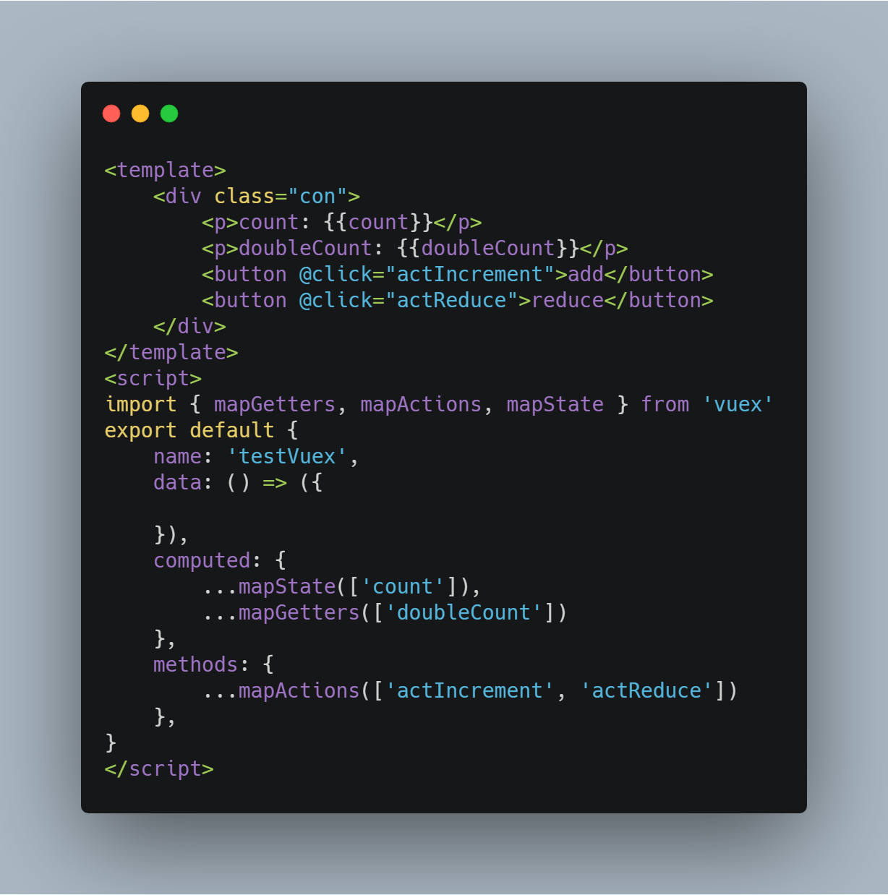

总结：在state里定义一个全局的数据，然后在项目中任何一个组件里进行获取，修改，并且我们的修改会得到全局的响应更改。
### 四. $attr / \$listener

#### 除Props外，在Vue发布2.4版本之后，出现了 $attr / \$listener

* $attr
包含了父作用域中不作为Prop识别的特性绑定，除class和style外，通过v-bind="\$attr"传入内部组件。
* $listener
包含了父作用域中v-on事件监听器(不含.native修饰器的)，通过v-bind="\$listener"传入内部组件。

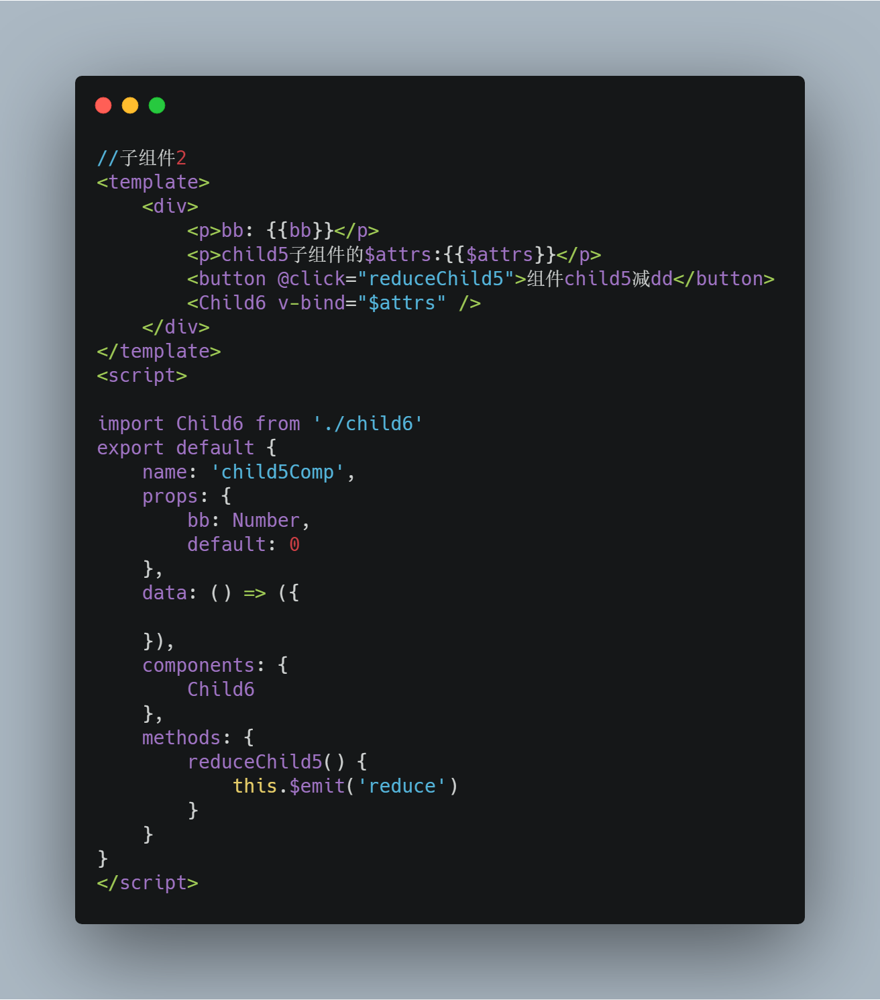

总结：\$attrs 里存放的是父组件中绑定的非 props 属性，$listeners 里面存放的是父组件中绑定的非原生事件。好处就是在传输数据、方式较多时，无需一一填写。

### 五. Provider / Inject

除了Props外，在Vue发布2.2版本之后，新增了Provider / Inject 两个API。父组件通过 Provider 传入变量，任意子孙组件通过 Inject 来拿到变量。

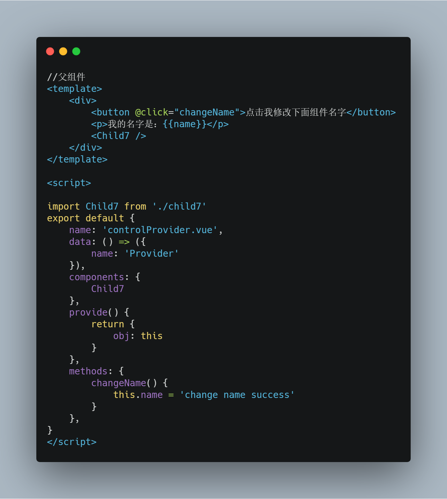
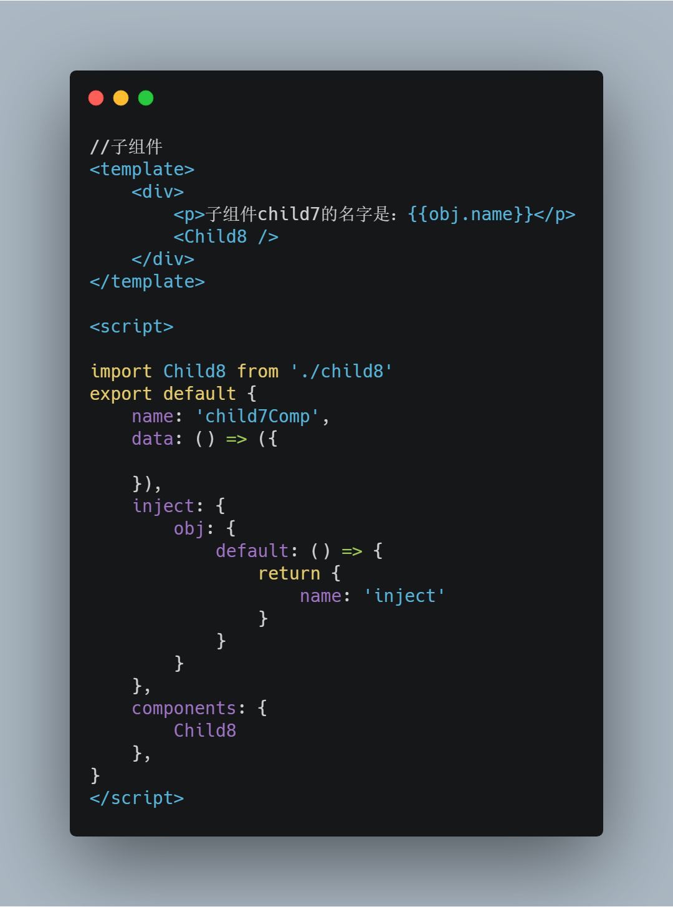
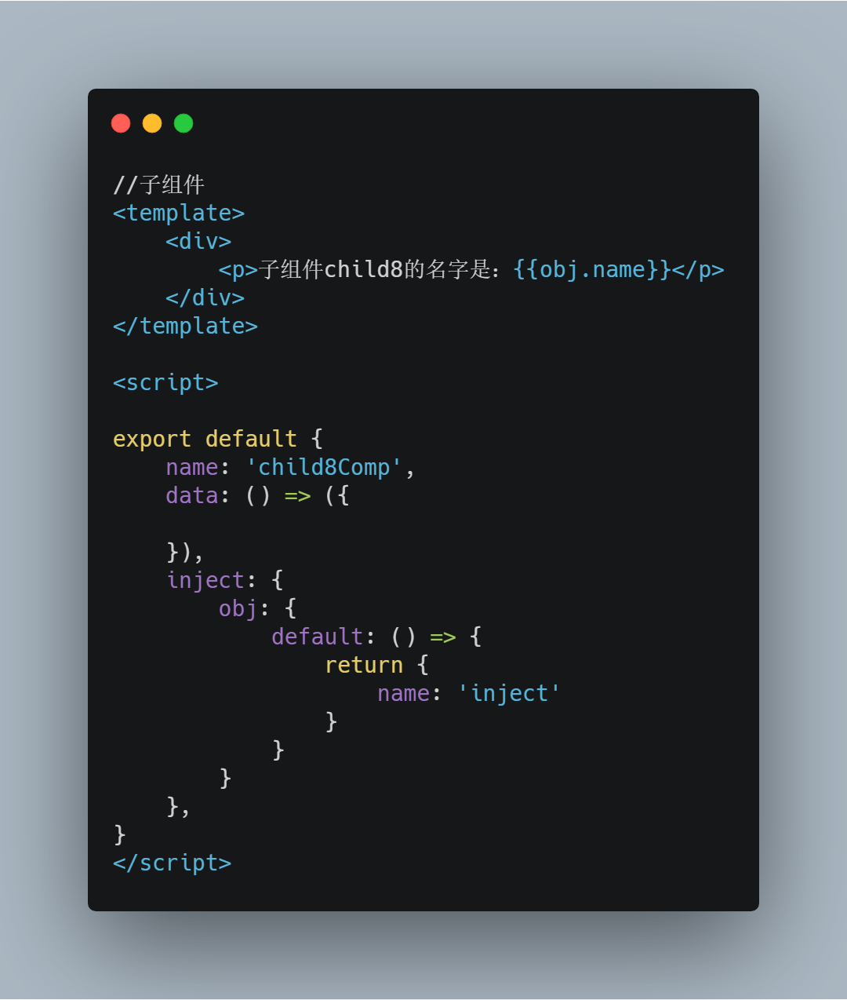
    
总结：父级组件往下传输数据，子孙组件一起共享数据。

### 六. \$parent / $children & \$refs

* \$parent / $children
在父子实例中，子实例用this.\$parent访问父实例，字实例被推入到父实例的\$children数组中。
* $refs
ref被用来给DOM元素或者是子组件注册引用信息，引用信息将会被注册在父组件的\$refs对象上。
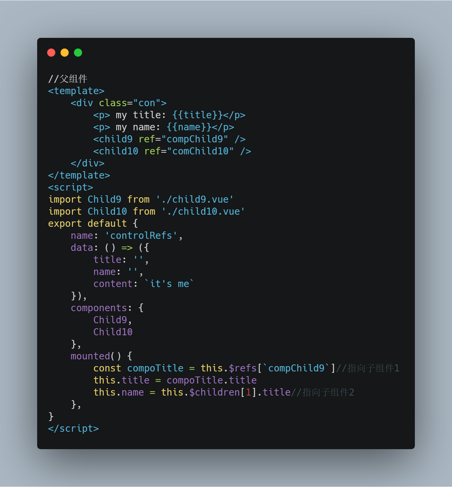

总结：只能在父子组件之间使用，不能跨级和兄弟间通信
## 总结
以上通信方式可分为三种：
1.父子间通信: 全部

2.兄弟间通信: \$emit / $on , Vuex

3.跨级通信: \$emit / $on , Vuex, provide / inject, \$attrs / \$listeners

